#项目报告

###爬虫程序

改爬虫程序是用python所编写的，用于爬取[Quora](https://www.quora.com)上的用户信息例有居住地，学校，关注人数，粉丝人数，提问数，回答数，关注话题数，回答总浏览数。

此次所用爬取策略是选取[Oliver Emberton](https://www.quora.com/profile/Oliver-Emberton)这位[Quora](https://www.quora.com)上的大牛，然后以他作为种子用户，爬取信息存储到MySQL数据库中，并爬取他所关注的人的URL，以此类推直到爬取到足够的数据。

选择爬取用户关注中的URL而不是粉丝中的URL，是避免爬取过多的“僵尸粉”，导致数据采集质量太低。

###数据分析

本次共爬取了12万个用户，由于一开始爬取时程序设计上有点小问题导致有一部分用户重复爬取，除去重复的用户后，剩余的有效用户数是119, 768个，因为收集到的数据相较于总数据而言只是小部分，所以做出的分析不一定能反映出真实完整的情况。

####数据总览

本次爬取共爬取了12万用户，其中除去重复用户剩余119,768个用户，分别爬取了他们居住地，学校，关注人数，粉丝人数，提问数，回答数，关注话题数，回答总浏览数，将它们存储在MySQL中，并导出到了Excel表格。

对于一个用户而言比较重要几项指标：**回答数**，**关注数**，**粉丝数**，**关注话题数**，**回答浏览数**。对这些指标进行计算，计算出它们的**平均数**，**中位数**，以及**标准差**，结果如下表：

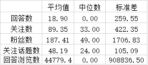

通过这个表格可以对大致对整体用户大致情况有所了解。可以看出各个指标的标准差以及它们平均数与中位数的差值都非常的大，这表示数据中的用户之间差距很大，用户大部分都处于两个极端，要么很大，要么很小，而处于中间的用户较少。特别是回答数和回答浏览数中，它们的中位数都是0，说明数据中的用户起码有一半是没有回答过问题的，这可以看出在各个用户个体之间的离散程度很高。

接下来我们对爬取下来的数据进行逐项分析。

####居住地国家统计分析

通过对居住地用各个国家的关键字进行过滤统计，对户的居住地进行统计，其中只过滤了**美国**，**印度**，**英国**，**澳大利亚**，**中国**这5个主要国家。结果如下：

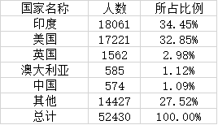
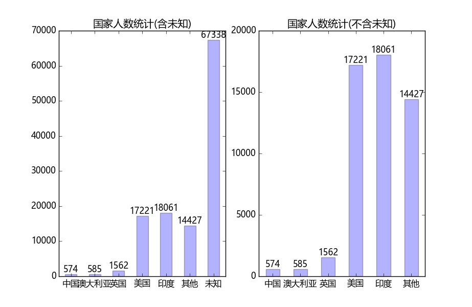

可以明显的看出在除去没有填写居住地的用户后**印度**的人数是最多的，然后是**美国**，**英国**，**澳大利亚**，最后是**中国**，人数第一的**印度**比人数第二的**美国**还要多1.6%左右，这有点出乎我的意料，因为[Quora](https://www.quora.com)是个美国的网站，我一开始是认为美国人数应该是最多的，没想到有这么多居住在印度的用户，居然比美国人还多。对为什么这么多印度用户的原因，经过我收集资料分析后我得出几个原因：

- 1.印度曾是英国的殖民地，所以英语水平较高，至今英语还是印度的官方语言之一
- 2.印度人口多，印度现在的人口是仅此中国的人口大国
- 3.[Quora](https://www.quora.com)起源于硅谷，一开始也是服务于硅谷，而硅谷基本等于半个印度

最主要原因就是印度人英语水平好，而且人数多基数大，所以印度用户人数占比例也就多了。

而我认为英国和澳大利亚的用户不多主要是因为国家人数不多，中国主要因为语言问题，以及中国有类似的中国本地化网站[知乎](https://www.zhihu.com/)导致用户不多。

####用户学历水平统计

对用户所填写的学校资料用关键字进行过滤，可以粗略的得到有关用户的学历信息统计。结果如下：

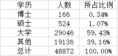
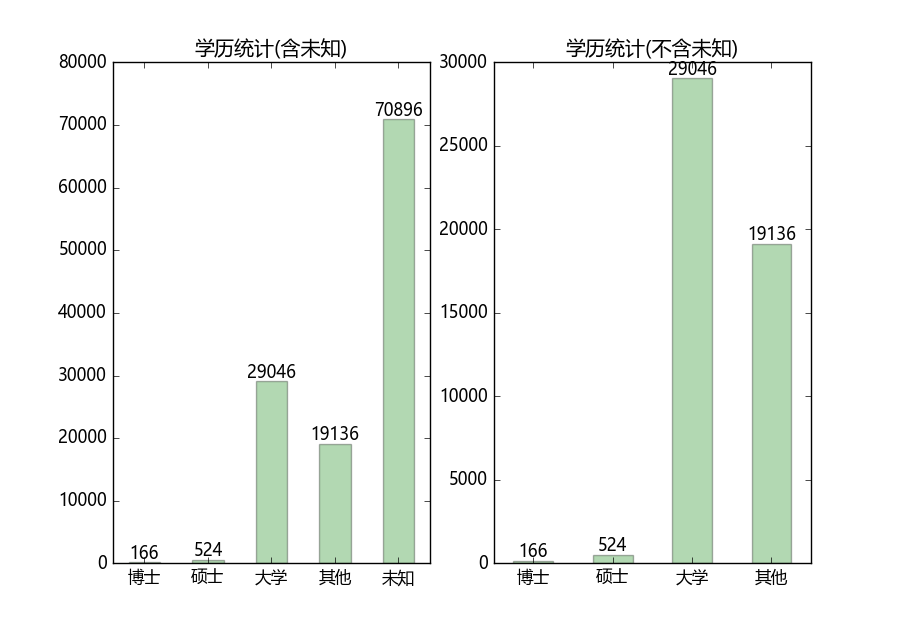

可以看出除去没有填写学校的用户后，有60%左右的用户学历都在大学及以上，其中有一小部分的博士和硕士。当然这是很粗略的筛选，只能大致放映出这组数据的学历情况。

####用户回答数统计

对用户的回答数进行分组统计，分别为0，0~10， 10~100， 100~1000， 1000以上。结果如下：

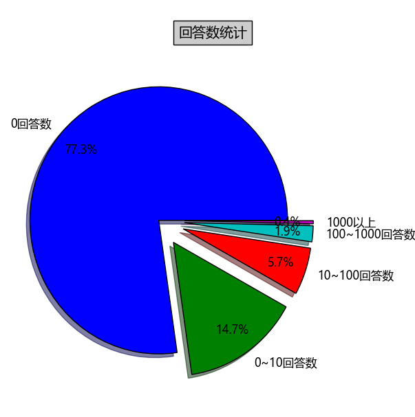

有92%左右的人回答数是小于10个，说明大部分用户都是作为观众的身份，去阅读别人的答案，而不是自己去回答问题。
还可以明显的看出大部分用户都是0回答数的，这个也是出乎我意料的，因为我是爬取关注的人的URL，所以这些用户都是有人关注的，我原以为是通过回答问题，因为问题的回答质量优秀而被别人关注。但从统计结果来看不全是这样的。有77.3%的用户都是没有回答，而有人关注的，其中他们的**粉丝平均数为77.31**，**最多的有16636个粉丝**。对这种现象我有以下几个猜测：

- 1.是现实中有名气的人，虽然没有回答，但是有人气，有粉丝过来关注
- 2.粉丝是他们现实中的亲朋好友，相互关注
- 3.是去关注别人，别人回粉给他
- 4.有可能被别人随机关注了

通过对回答数为0粉丝最多的前五个人[Shreya Ghoshal](https://www.quora.com/profile/Shreya-Ghoshal)，[Chris Hughes](https://www.quora.com/profile/Chris-Hughes)，[Marc Benioff](https://www.quora.com/profile/Marc-Benioff)，[Jeff Jarvis](https://www.quora.com/profile/Jeff-Jarvis)，[Ron Wyden](https://www.quora.com/profile/Ron-Wyden)的主页和facebook，twitter以及搜索发现[Shreya Ghoshal](https://www.quora.com/profile/Shreya-Ghoshal)是一个印度的女歌手。[Chris Hughes](https://www.quora.com/profile/Chris-Hughes)是Facebook联合创始人。[Marc Benioff](https://www.quora.com/profile/Marc-Benioff)是美国互联网企业家，Salesforce创始人。[Jeff Jarvis](https://www.quora.com/profile/Jeff-Jarvis)是一位作家。[Ron Wyden](https://www.quora.com/profile/Ron-Wyden)是美国俄勒冈州的参议员。可以发现没有回答数粉丝多的都是现实中的名人，而他们的粉丝应该都是被他们名气所吸引的。而粉丝少的应该大部分都是**2**和**3**的可能,而只有几个粉丝的人应该是**4**的可能。

####关注话题数统计

对用户的关注话题数进行分组统计，分别为0，0~10， 10~100， 100~1000， 1000以上。结果如下：

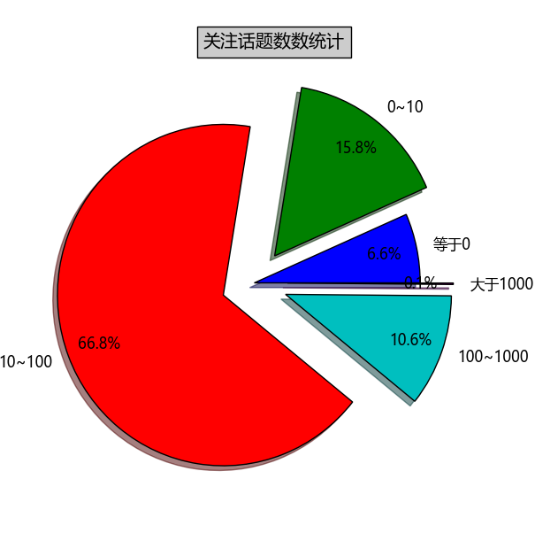

通过对用户关注话题数可以从侧面反映出用户的活跃程度。而有77.6%左右的用户都有关注10个以上的话题，其中有10.7%的用户关注了100个话题以上。通过统计结果可以从侧面反映出数据中的用户活跃程度应该是不错的。

####粉丝数、回答数和回答阅览量分析
首先我们来看下在经过排列后根据用户索引所得到与用户粉丝数、回答阅览量得到的图像

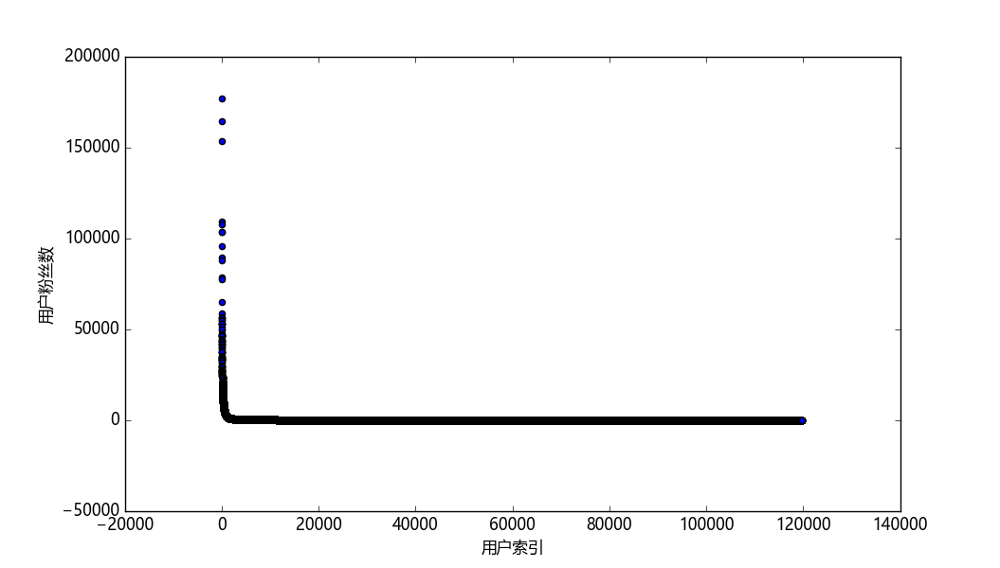
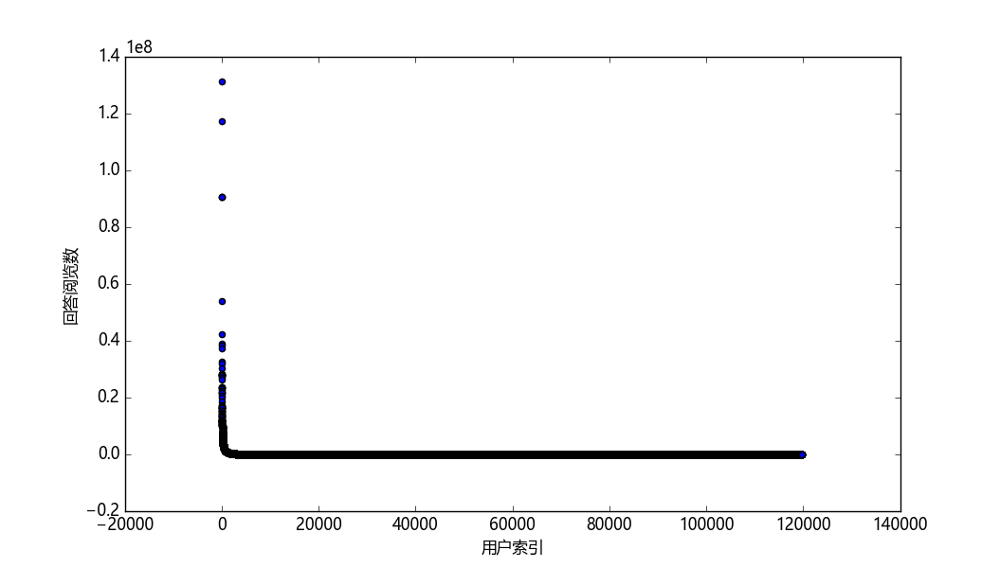

可以清楚的看出这两个图上都有着一条长长的“尾巴”，而且在这条尾巴头部的顶端越往上点的个数就越少，而在这长长的尾巴中就是我们这些普通的用户，而这有少数的用户拥有着大量的粉丝以及阅览量，说明在用户之间差距是很大，多的人很多，少的人很少。不过这也是正常的，因为一个优秀回答者，他会有自己优秀的回答从而获得关注，然后会有更多人看到他的回答，他的阅览量也会越来越多，又因为他的回答质量优秀从而吸引更多的粉丝，获得更多的阅览量，影响力越来越大，造成一种“滚雪球”的现象。最后就和普通用户的差距越拉越大。

那么我们可以探究下用户的回答数和他的粉丝数会不会有关系，会不会因为有更多的回答，而更容易得到粉丝。
**（由于数据比较大，所以我对两个坐标都去log10，这样更容易观察）**

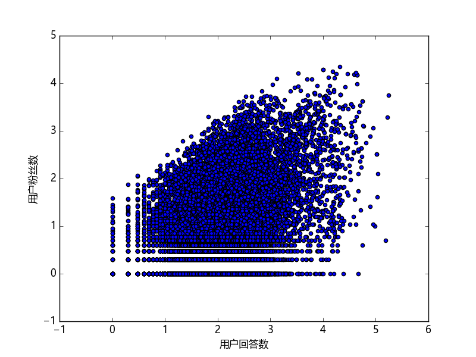

经过计算用户粉丝数与用户回答数的相关系数是**0.32**左右，结合用户粉丝数与用户回答数的关系图来看，用户所获得粉丝数与用户回答的个数多少，没有太大的关系，说明回答数多，不一定就能有更多的粉丝，所以粉丝看中的回答问题的质量而不是数量。

最后我们再来看看回答阅览数与用户粉丝数、用户回答数之间的关系
**（由于数据比较大，所以这里也是取的log10，便于观察）**

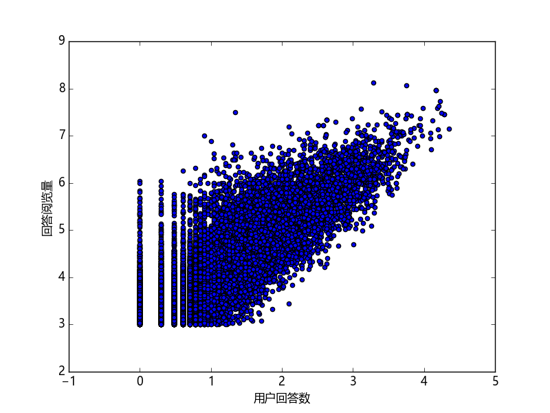
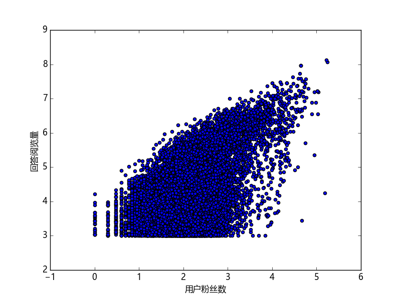

而回答阅览量与粉丝的相关系数是**0.63**，回答阅览量与回答数的相关系数是**0.69**，结合这上面这两张关系图可以看出粉丝数和回答数都与回答阅览量都有着一定的正相关关系。这意味着一个人他的粉丝数越多他的回答也越容易被别人看到，他的影响力也就越大。而回答浏览数与回答数也有着正相关的关系，而且关系更紧密，这代表一个回答问题数越多，就越有机会被别人看到他的回答。

####结言
虽然这个数据分析只是个对数据简单的分析，没有什么特别深入的挖掘，只是简单的统计，爬取的信息也不多，数据量也不是很大，不一定能够准确说明问题，这次数据分析就是对这次爬取下来的数据里面一些比较明显的规律做出一些总结。但在这次数据分析让我感受到了数据分析的乐趣，在一大推数据当中，它们之间是有一些关系和规律存在，在对它们进行统计的时候可以感受的出来。总的来说这次的数据分析锻炼我了不少，第一次观察这么多的数据，对它们进行统计，让我对数据分析有了初步的了解。

###个人感受
经过这两轮的考核，我感觉还是收获了很多，不只是在知识上的，还有是在学习方法上。虽然在考核过程中，遇到了很多问题，尽管但是在最后也算是是解决。

第二轮考核中我感觉工作量和代码量都比第一轮的考核要少，但是遇到的问题却比第一轮考核的时候多。主要是因为这次项目是牵涉到网络还有一些很网页相关的知识，所以有时候会遇上一些奇怪的问题。尽管如此，但我在做第二轮考核的时候还是感觉比做第一轮考核时更有意思，尤其是在数据分析的时候，收集到了大量的数据，要从中分析出一些其中蕴含的规律，以及一些明显的现象，在这个过程中还是很有趣，可以从另一个角度去了解用户的信息和用户的行为，得出一些简单结论。

在这比考核中我遇到的问题主要是在编写爬虫程序的时候遇到的，虽然python的基本语法比较简单，但是编写爬虫的时候会遇到一些细节问题。就像我要编写获取Quora登录cookies的时候，一开始我是想用post请求来获取的，但是在观察了Quora的登录post请求后，发现他的参数比较复杂，经过我多次尝试也没能成功登录，在网上也找不到解决方法。在卡了我一两天后，我放弃用post请求做，而是用了selenium + phantomjs模拟浏览器，这种方法虽然比较简单，但是效率却比较低，所以我没有优先考虑这个方法。而一开始用这个方法的时候也遇到了一些问题，应该是因为输入的太快网页反应不过来，需要在操作后暂停一段时间再操作，就是这个小问题再当时也困扰了我很久，但最后还是解决了。但是不是所有问题最后都能解决的，我一开始是想统计每个用户回答获得的总赞同数的，但是Quora并没有统计用户获得的总赞同数，所以我就是想把用户的每个回答获得的赞同数加起来，但是又发现在用户界面中，用户回答用的是异步加载，需要你将界面滚到最后才会加载下一页，虽然我观察出了网站的请求，但是发现他的请求参数比较复杂，而且我没搞明白那些参数是哪里来的。后来我是想用selenium + phantomjs模拟浏览器进行滚动，然后获取完整网页，无奈这种方法效率太低，而且也不一定能完整爬取数据，最后只好放弃统计这项数据。所以这次给我很多解决这类问题经验，要善于利用搜索引擎去查找自己需要的信息。

尽管大致完成了要求，但感觉自己爬虫写的还是过于简单，写的不是特别好还有很大的改善空间。不管这次考核结果如何，在这段时间也有所收获了，在之后我会继续坚持的。